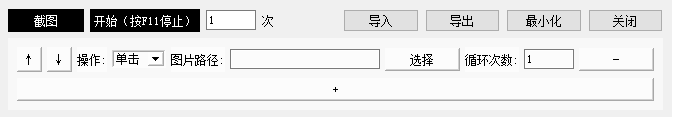

# niuma-ModelWorker

简介：

Click on the computer screen according to the picture.

根据图片点击电脑屏幕。


Use TONGYI lingma text interaction to automatically generate the body code, the code is for learning only.

使用TONGYI lingma文字交互自动生成主体代码，代码仅供学习。



开发环境：

* window10
* python3

运行：

```
pip install -r requirements.txt
python run.py
```

构建成exe：

```
pyinstaller --onefile --windowed --add-data "./*;." --icon=logo/logo.ico run.py --name=niuma
```

功能项：

1 截图：新截图默认存放在当前目录的images文件夹下。（系统自带的都比这个好用 = =、主要是为了测试屏幕图像能不能被截图）

* 主要用于在屏幕上识别该图片
* pyautogui.locateOnScreen获取图片位置
* 可以自己准备图片或其它软件截图

2 整体动作循环：

* 默认执行1次
* -1代表无限循环
* 按F11停止循环

3 单行动作循环：

* 上按钮：动作向上移动一位
* 下按钮：动作向下移动一位
* 删除按钮：删除一行需要执行的动作
* 添加按钮：增加一行需要执行的动作
* 操作按钮：
  单击：根据图片在屏幕查找位置，然后鼠标左键点击一下
  双击：根据图片在屏幕查找位置，然后鼠标左键双击一下
  等待：暂停多少时间（秒）
  输入：输入文本，并按enter按钮

4 其它按钮功能：

* 导入按钮：yaml格式导入已编排好的动作顺序。
* 导出按钮：yaml格式导出编排号的动作顺序。
* 最小化：隐藏窗口
* 关闭：退出程序

当前待优化问题：

1 界面没有加UI图片——丑！

2 当前仅支持windows系统

3 图片需要在新环境中重新截取，分辨率不同会导致获取位置失败

4 屏幕界面存在防截图功能，会导致图片识别获取位置失败
